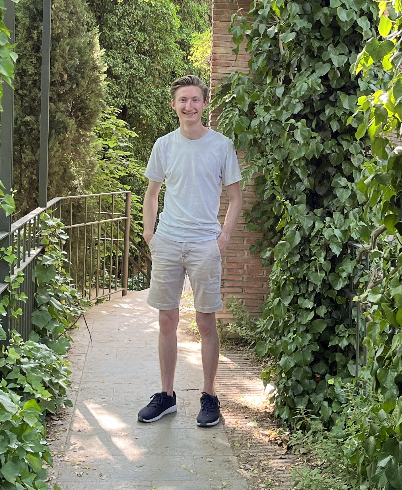

# About Me

I am a second year Ph.D Student studying Computer Science at the [University of Southern California](cs.usc.edu) in the [CPS-VIDA](cps-vida.github.io) lab. My research interests are in applying game theory to cyber-physical systems. 

I graduated with a BS in Computer Science from the University of Colorado Boulder in 2022. Outside of academics, I enjoy rock climbing and I homebrew beer. 