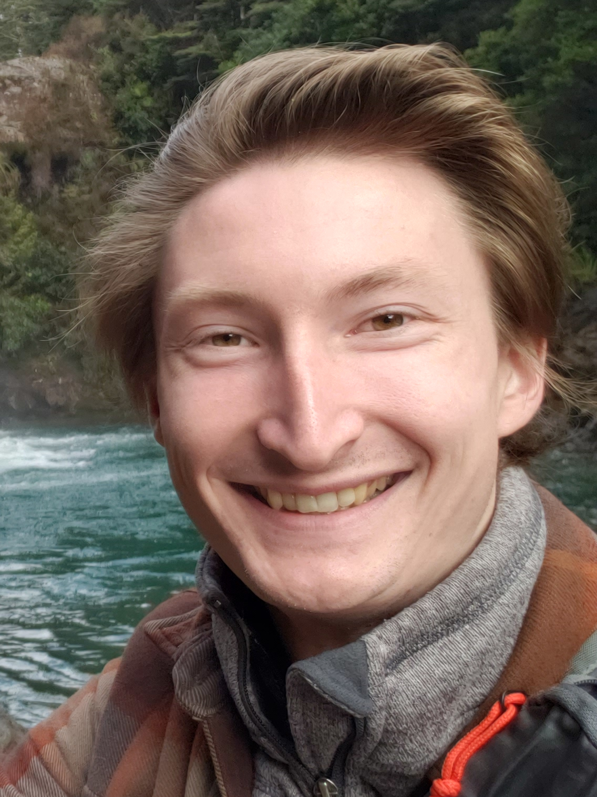

# About Me

I am a fourth year Ph.D Student studying Computer Science at the [University of Southern California](https://cs.usc.edu) in the [CPS-VIDA](https://cps-vida.github.io) lab, advised by Prof. [Jyotirmoy Deshmukh](https://jdeshmukh.github.io/). My research interests are in exploring applications of game theory inside of formal planners and model checkers. 

I graduated with a BS in Computer Science from the University of Colorado Boulder in 2022. Outside of academics, I enjoy rock climbing, gardening, and I homebrew beer. 

## Links

[CV](resume.pdf) and [LinkedIn](https://www.linkedin.com/in/sam-williams-ab18a1171)